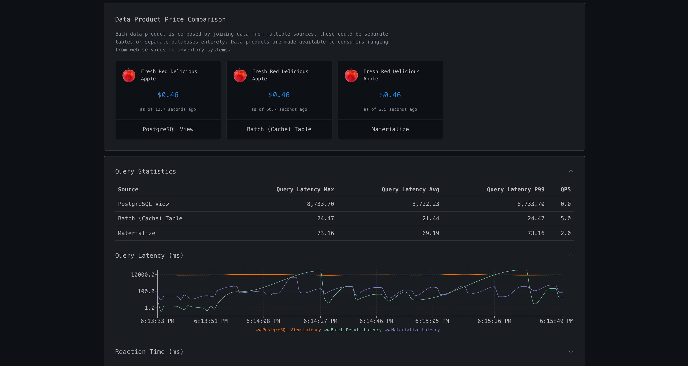

# Freshmart Evolution Demo

This project demonstrates different approaches to implementing real-time data integration and transformation in an e-commerce setting, comparing PostgreSQL views, batch computation (cached tables), and Materialize for real-time price updates. It provides real-time visualization of query performance, data freshness, and system behavior.



## Features

- Real-time price comparison across three implementations:
  - PostgreSQL View (direct query)
  - Batch Computation (cached table)
  - Materialize (incremental view maintenance)

- Performance monitoring:
  - Query latency tracking for all implementations
  - Query throughput (QPS) measurements
  - End-to-end reaction time analysis
  - Database size monitoring
  - CPU and Memory usage tracking

- Data freshness tracking:
  - Batch computation refresh age
  - Materialize replication lag
  - Cache rehydration time statistics

- Interactive scenarios:
  - Direct View Queries
  - Add Batch Computation
  - Add Materialize
  - Full Query Offload (CQRS)

- Visual analytics:
  - Real-time price updates with visual feedback
  - Query latency charts
  - CPU and Memory usage charts
  - Comprehensive statistics table
  - Interactive RAG response component:
    - Real-time latency display
    - Dynamic response updates based on OLTP data
    - Scenario-aware latency tracking
    - Smooth transitions between query modes

## Architectural Patterns

The demo showcases three key architectural patterns:

1. Query Offload:
   - Offload complex analytical queries from operational database
   - Maintain OLTP performance while enabling analytics
   - Scale read capacity independently

2. Integration Hub:
   - Create a real-time operational data store
   - Integrate data from multiple sources
   - Enable real-time data products

3. Operational Data Mesh:
   - Create decentralized, domain-oriented data products
   - Maintain real-time consistency
   - Enable domain-driven data architecture

## Technical Implementation

### Query Performance Tracking

The system tracks several performance metrics:
- Query latency (time to execute the query)
- End-to-end latency (total time including data propagation)
- Queries per second (QPS)
- Statistical aggregates (max, average, p99)

### Resource Monitoring

1. CPU Usage:
   - Per-container CPU utilization
   - Real-time CPU metrics
   - Historical CPU trends

2. Memory Usage:
   - Container memory consumption
   - Database size tracking
   - Memory utilization patterns

### Database Connections

The application maintains separate connection pools for:
- PostgreSQL: For direct view queries and batch computation
- Materialize: For real-time materialized views

### Error Handling

- Graceful degradation on connection issues
- Automatic retry mechanisms
- Visual error feedback in the UI
- Timeout handling for long-running operations

## Project Structure

```
.
├── backend/
│   ├── app/
│   │   ├── main.py         # FastAPI application
│   │   └── database.py     # Database operations and metrics
│   └── requirements.txt    # Python dependencies
├── frontend/
│   ├── src/
│   │   ├── App.jsx         # Main React application
│   │   └── components/     # React components
│   └── package.json        # Node.js dependencies
└── scripts/               # Setup and utility scripts
```

## Quick Start

> ⚠️ **Hardware Requirements**
> - CPU: 8+ cores recommended
> - RAM: 12GB+ recommended (Make sure docker has access to at least this amount of memory)
>
> For systems with limited resources, you can use the reduced dataset option:
> ```bash
> REDUCED_DATA=true docker compose up
> ```

The easiest way to run the application is using Docker Compose:

```bash
docker compose up
```

This will start all required services:
- PostgreSQL database
- Materialize instance
- Backend API server
- Frontend development server

Once all services are running, visit http://localhost:5173 to access the application.

### **Demo Verticals**

This demo supports two industry verticals, each showcasing real-time data integration for a different domain:

### **1. Freshmart (E-commerce & Logistics) (Default)**
A retailer dynamically adjusts pricing based on inventory, demand, and promotions.

### **2. FreshFund (Financial Services)**
A financial institution tracks securities pricing, portfolio values, and capital allocation.  


### **Switching Between Verticals**
Set the `DEMO` environment variable before running:

```bash
DEMO=freshfund docker compose up
```
or
```bash
DEMO=freshmart docker compose up
```

You will always need to destroy volumes before switching demos. 

```bash
docker-compose down --volumes
```

See [VERTICAL.md](VERTICAL.md) for more details on adding a new vertical.

## Manual Setup

### Prerequisites

1. PostgreSQL database (14+)
2. Materialize instance (v2024.01.1+)
3. Python 3.9+
4. Node.js 18+

### Environment Configuration

Create a `.env` file in the backend directory:
```
# PostgreSQL configuration
DB_HOST=localhost
DB_NAME=postgres
DB_USER=postgres
DB_PASSWORD=postgres

# Materialize configuration
MZ_HOST=localhost
MZ_PORT=6875
MZ_USER=materialize
MZ_PASSWORD=materialize
MZ_NAME=materialize
```

### Backend Setup

1. Install Python dependencies:
```bash
cd backend
pip install -r requirements.txt
```

2. Start the FastAPI server:
```bash
uvicorn app.main:app --reload
```

### Frontend Setup

1. Install Node.js dependencies:
```bash
cd frontend
npm install
```

2. Start the development server:
```bash
npm run dev
```

## Usage Guide

1. Access the application at http://localhost:5173
2. Choose a scenario to explore:
   - Direct View Queries: Baseline implementation
   - Add Batch Computation: Introduce caching
   - Add Materialize: Enable real-time updates
   - Full Query Offload: Complete CQRS pattern

3. Monitor the real-time displays:
   - Price comparisons across implementations
   - Query performance metrics
   - CPU and memory usage
   - System statistics

4. Analyze performance through:
   - Query latency charts
   - Resource utilization graphs
   - Statistical summaries
   - Reaction time analysis

## Performance Characteristics

The demo illustrates the trade-offs between different implementation approaches:

1. PostgreSQL View:
   - Always fresh data
   - Higher latency
   - Direct query overhead
   - Resource-intensive for complex queries

2. Batch Computation:
   - Low query latency
   - Periodic refresh overhead
   - Configurable freshness
   - Predictable performance

3. Materialize:
   - Real-time updates
   - Low query latency
   - Incremental maintenance
   - Efficient resource utilization

These characteristics help in understanding the best approach for different use cases in real-time data integration scenarios.
